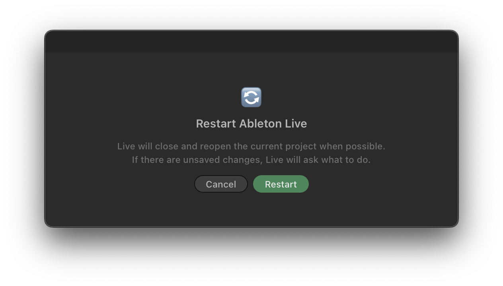

<div align="center">

# 🔄 Restart Live Button

**Restart Ableton Live without ever leaving Live.**

[](https://github.com/4TheDoctor/restart-live-button/stargazers)
[](https://github.com/4TheDoctor/restart-live-button/releases)
[](https://www.ableton.com)
[](#license)



</div>

---

## ✨ What it does

Right-click a track, clip, scene, clip slot, or Arrangement selection → **Restart Ableton Live…**

| | |
|---|---|
| 🪟 **One-click confirm** | A clean restart dialog, no terminal, no Activity Monitor |
| 💾 **Safe by default** | Unsaved changes? Live shows its native save dialog first |
| 📂 **Picks up where you left off** | Reopens the current project when possible |
| 🎯 **Version-aware** | Uses the same Live app version that launched the extension |

---

## 📦 Install

1. Download `restart-live-button-1.0.4.ablx` from [Releases](https://github.com/4TheDoctor/restart-live-button/releases)
2. Open Ableton Live 12 Beta
3. Go to **Preferences → Extensions**
4. Drag the `.ablx` file into the Extensions list
5. Restart Ableton Live when Live asks you to. Yes, seriously.

> Take a breath. Enjoy the ritual. This should be the last time you ever restart Live manually.

Done. Right-click anywhere in Live to use it.

---

## ✅ Requirements

- **Ableton Live 12 Beta** — the Extensions API is currently in beta
- **macOS** — the restart logic uses AppleScript + `open`

---

## 🛠️ Build from source

```sh
git clone https://github.com/4TheDoctor/restart-live-button.git
cd restart-live-button
npm install
```

Create `.env` with your Extension Host path:
```
EXTENSION_HOST_PATH=/Applications/Ableton Live 12 Beta.app/Contents/Helpers/ExtensionHost/ExtensionHostNodeModule.node
```

```sh
npm start        # dev mode — loads into Live with hot reload
npm run package  # builds .ablx for distribution
```

---

## ⭐ Star History

<a href="https://www.star-history.com/?type=date&repos=4TheDoctor%2Frestart-live-button">
 <picture>
   <source media="(prefers-color-scheme: dark)" srcset="https://api.star-history.com/chart?repos=4TheDoctor/restart-live-button&type=date&theme=dark&legend=top-left" />
   <source media="(prefers-color-scheme: light)" srcset="https://api.star-history.com/chart?repos=4TheDoctor/restart-live-button&type=date&legend=top-left" />
   
 </picture>
</a>

---

## 📄 License

MIT © [4TheDoctor](https://github.com/4TheDoctor)
