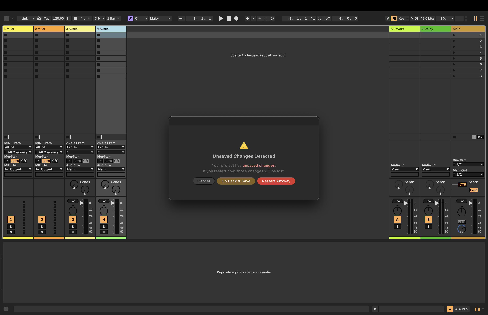

# Restart Live Button

[](https://github.com/DrYS444/restart-live-button/stargazers)
[](https://github.com/DrYS444/restart-live-button/releases)
[](https://www.ableton.com)

Restart Ableton Live from a right-click menu — with smart unsaved changes detection.



---

## What it does

Right-click any **track** or **scene** → **Restart Ableton Live…**

- If your project has **unsaved changes** → shows a warning with "Go Back & Save" and "Restart Anyway"
- If your project is **already saved** → simple confirmation, then restarts
- Automatically reopens the correct Live version (works if you have multiple versions installed)

---

## Install

1. Download `restart-live-button-1.0.0.ablx` from [Releases](https://github.com/DrYS444/restart-live-button/releases)
2. Open Ableton Live 12 Beta
3. Go to **Preferences → Extensions**
4. Drag the `.ablx` file into the Extensions list

Done. Right-click any track or scene to use it.

---

## Requirements

- **Ableton Live 12 Beta** (Extensions API is currently in beta)
- macOS (the restart logic uses AppleScript + `open`)

---

## Build from source

```sh
git clone https://github.com/DrYS444/restart-live-button.git
cd restart-live-button
npm install
```

Create `.env` with your Extension Host path:
```
EXTENSION_HOST_PATH=/Applications/Ableton Live 12 Beta.app/Contents/Helpers/ExtensionHost/ExtensionHostNodeModule.node
```

```sh
npm start        # dev mode — loads into Live with hot reload
npm run package  # builds .ablx for distribution
```

---

## Star History

<a href="https://www.star-history.com/?type=date&repos=DrYS444%2Frestart-live-button">
 <picture>
   <source media="(prefers-color-scheme: dark)" srcset="https://api.star-history.com/chart?repos=DrYS444/restart-live-button&type=date&theme=dark&legend=top-left" />
   <source media="(prefers-color-scheme: light)" srcset="https://api.star-history.com/chart?repos=DrYS444/restart-live-button&type=date&legend=top-left" />
   
 </picture>
</a>

---

## License

MIT
